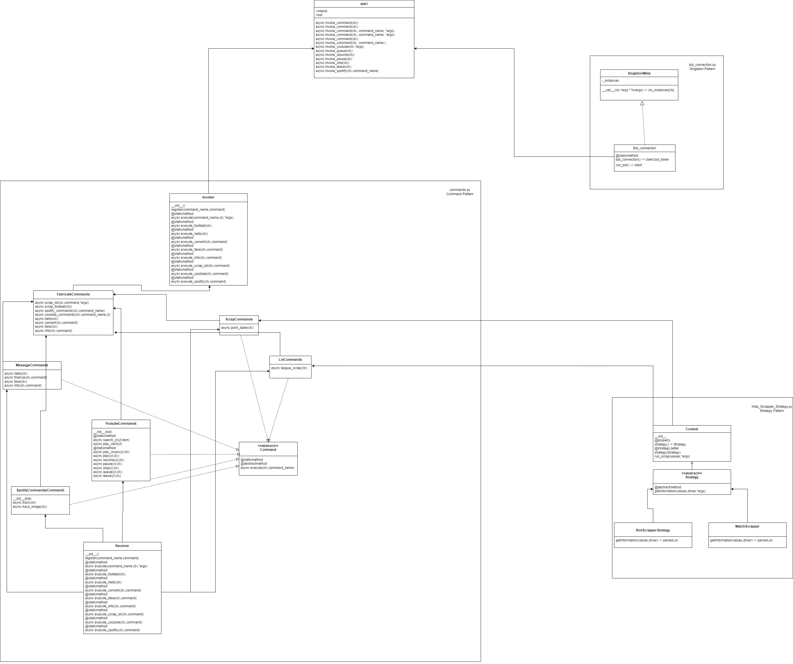

# Discord Bot with Music and Web Scraping

This Discord bot, developed in Python, is designed to perform various functionalities, including playing music from YouTube, handling Spotify commands, and web scraping for information related to League of Legends and football point tables. The bot utilizes the Discord API, asyncio, and various Python libraries for web scraping, music handling, and more.

## Features

### 1. Music Commands

- **Play Command (`!play [song]`):** Play a selected song from YouTube.
- **Pause Command (`!pause`):** Pause the currently playing song.
- **Resume Command (`!resume`):** Resume a paused song.
- **Skip Command (`!skip`):** Skip to the next song in the queue.
- **Queue Command (`!queue`):** Display the current music queue.
- **Leave Command (`!leave`):** Make the bot leave the voice channel.

### 2. Spotify Commands

- **Track Command (`!track`):** Display information about the currently playing track on Spotify.
- **Image Command (`!image`):** Generate an image with track information from Spotify.


### 3. Web Scraping Commands

- **Points Command (`!points`):** Display the Turkish Super League point table.
- **League of Legends Command (`!lol [username] [Server] [lol_id]`):** Display League of Legends information for the specified user.

### 4. Message Commands

- **Hello Command (`!hello`):** Send a greeting message.
- **Finance Command (`!convert [amount][currency]`):** Convert currency using the current exchange rate.
- **Fake Command (`!fake`):** Generate fake identity information.
- **Info Command (`!info [query]`):** Retrieve information using a search query.

## Design Patterns
### 1. Strategy Pattern:

      Intent: The Strategy Pattern defines a family of algorithms, encapsulates each one, and makes them interchangeable. It lets the algorithm vary independently from clients that use it.
      Use Case: Use this pattern when you want to define a family of algorithms, encapsulate each one, and make them interchangeable. It allows a client class to choose an algorithm from a family of algorithms at runtime.
      Role Of Project: Web scrapping class.

### 2. Command Pattern:

      Intent: The Command Pattern turns a request into a stand-alone object that contains all information about the request. This transformation lets you parameterize clients with queues, requests, and operations, and support undoable operations.
      Use Case: Use this pattern when you want to decouple the sender and receiver of a request. It allows you to parameterize objects with operations, queue operations, and support undo functionality.
      Role Of Project: Discord bot commands.

### 3. Singleton Pattern:

      Intent: The Singleton Pattern ensures a class has only one instance and provides a global point to this instance.
      Use Case: Use this pattern when exactly one instance of a class is needed to coordinate actions across the system. It provides a single point of access to that instance.
      Role Of Project: Bot connection.

## Prerequisites

To run this bot, you need the following:

- **Python 3.x**
- **Discord API Token:** Obtain your Discord bot token by creating a bot on the [Discord Developer Portal](https://discord.com/developers/applications).

## Installation

1. Clone the repository:

   ```bash
   git clone https://github.com/GioGio7777/Design_Pattern_Discord_Bot.git
   cd Design_Pattern_Discord_Bot


2. Install dependencies:
    ```bash
    pip install -r requirements.txt

## Installing ffmpeg
1. First download in https://www.ffmpeg.org/download.html
2. Add Path ffmpeg-full_build\bin

## Set up environment variables:
1. Create a .env file in the project root.

2. Add your Discord bot token:
    ```bash
    BOT_TOKEN=your_discord_bot_token
    CLIENT_ID=your_discord_bot_client_id
    SERVER_ID="your_discord_bot_server_id
   ```
   
## Running the bot
```bash
python start.py
```

## System Architecture 


